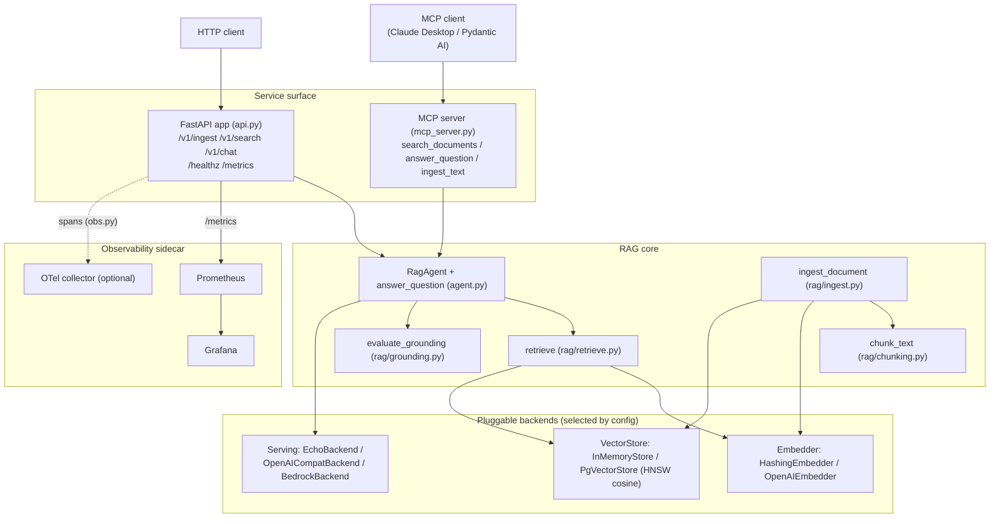

# Architecture

## Overview

The Sovereign AI Platform is a self-hostable retrieval-augmented generation (RAG)
and agent-serving platform built for regulated, data-sovereign environments — in
particular a bilingual (English/Arabic) public-sector context where confidential
data must not leave the deployment boundary. Every backend that touches a model,
an embedding, or a vector index sits behind a small interface and is selected by
configuration, so the same code and image run fully offline in CI and the demo
(deterministic hashing embedder, an echo LLM backend, an in-memory vector store)
and switch to production backends (self-hosted vLLM/TGI or AWS Bedrock, real
embeddings, PostgreSQL + pgvector) purely through `SOVEREIGN_`-prefixed
environment variables. The platform is exposed both as a FastAPI HTTP service and
as an MCP server, which share one implementation of the RAG pipeline.

## Request flow

### Ingest (`POST /v1/ingest`, MCP `ingest_text`)

`ingest_document` (`rag/ingest.py`) is idempotent per `doc_id`:

1. Resolve the `doc_id` (explicit, or a BLAKE2b hash of the source).
2. **Delete** any existing chunks for that `doc_id` so re-ingesting replaces
   rather than duplicates (`replaced` is reported back).
3. **Chunk** the text (`rag/chunking.py`): split on paragraph/sentence
   boundaries, pack segments up to `chunk_tokens` words, carry `chunk_overlap`
   trailing words between chunks to preserve cross-boundary context.
4. **Embed** all chunks in one batch (`Embedder.embed`).
5. **Upsert** the resulting `Record`s (id `{doc_id}::{ordinal}`, text, ordinal,
   metadata including `source`, and the embedding) into the vector store.

### Chat (`POST /v1/chat`, MCP `answer_question`)

`answer_question` (`agent.py`) is the core RAG flow:

1. **Retrieve** (`rag/retrieve.py`): embed the question, recall
   `rerank_candidates` nearest chunks from the store.
2. **Two-stage rerank**: score each candidate's lexical overlap with the query
   and blend it with the vector score (`alpha * vector_score + (1 - alpha) *
   lexical`), re-sort, keep `top_k`.
3. **Grounded prompt**: build a system prompt that instructs answering *only* from
   the provided context (in the requested language), plus a context block of the
   retrieved chunks with `[n] (source: ...)` citations, plus the user question.
4. **Generate** via the configured serving backend, returning a `Completion` with
   token usage.
5. **Grounding eval** (`rag/grounding.py`): score the answer's per-sentence
   lexical support against the retrieved context.
6. **Optional guardrail**: when `block_ungrounded` is set and the answer scores
   below threshold, replace it with an explicit refusal.
7. **Respond** with the answer, citations, grounding score and `grounded` flag,
   model id, and token usage. The API records LLM latency, token counts, output-
   token distribution, grounding score, and a guardrail-block counter along the
   way. `POST /v1/chat` returns `409` if the knowledge base is empty.

`POST /v1/search` runs steps 1–2 only and returns hits with both the blended
`score` and the raw `vector_score`.

## Component diagram

## Backends & configuration

Each concern has a `typing.Protocol` and a `build_*(settings)` factory. Offline
defaults are deterministic and dependency-free; production backends are imported
lazily and need the relevant install extra.

| Concern      | Interface / factory                       | Offline default (CI/demo)                          | Production option                                            | Controlling env var                                                  |
|--------------|-------------------------------------------|----------------------------------------------------|-------------------------------------------------------------|----------------------------------------------------------------------|
| Serving      | `ServingBackend` / `build_backend` (`serving.py`)   | `EchoBackend` — deterministic extractive answer    | `OpenAICompatBackend` (self-hosted vLLM/TGI) or `BedrockBackend` | `SOVEREIGN_SERVING_BACKEND` = `echo` \| `openai` \| `bedrock`        |
| Embeddings   | `Embedder` / `build_embedder` (`embeddings.py`)     | `HashingEmbedder` — hashed unigram+bigram vectors  | `OpenAIEmbedder` (OpenAI-compatible endpoint)               | `SOVEREIGN_EMBEDDING_BACKEND` = `hashing` \| `openai`               |
| Vector store | `VectorStore` / `build_store` (`rag/store.py`)      | `InMemoryStore` — exact cosine, O(n) per query     | `PgVectorStore` — PostgreSQL + pgvector, HNSW cosine index  | `SOVEREIGN_DATABASE_URL` (unset → in-memory)                        |

Supporting variables include `SOVEREIGN_OPENAI_BASE_URL` / `SOVEREIGN_OPENAI_API_KEY`
/ `SOVEREIGN_SERVING_MODEL` (vLLM/TGI target), `SOVEREIGN_BEDROCK_MODEL_ID` /
`SOVEREIGN_AWS_REGION`, `SOVEREIGN_EMBEDDING_MODEL` / `SOVEREIGN_EMBEDDING_DIM`,
`SOVEREIGN_VECTOR_TABLE`, the retrieval knobs (`SOVEREIGN_TOP_K`,
`SOVEREIGN_RERANK`, `SOVEREIGN_RERANK_CANDIDATES`, `SOVEREIGN_CHUNK_TOKENS`,
`SOVEREIGN_CHUNK_OVERLAP`), and observability (`SOVEREIGN_OTEL_ENABLED`,
`SOVEREIGN_OTEL_EXPORTER_OTLP_ENDPOINT`). See `config.py` for the full typed set.

## Observability

`obs.py` exposes Prometheus metrics at `GET /metrics` and best-effort OpenTelemetry
tracing (opt-in via `SOVEREIGN_OTEL_ENABLED`; setup never crashes the app). Beyond
generic request RED metrics, the LLM-specific signals are first-class:

- **Token throughput** (`sovereign_llm_tokens_total`, by model and prompt/
  completion) — capacity planning and cost/usage attribution per model.
- **Output-token distribution** (`sovereign_llm_output_tokens` histogram) —
  runaway or truncated generations show up as distribution shifts, not averages.
- **LLM latency** (`sovereign_llm_latency_seconds` by model) — the dominant
  contributor to user-facing latency; tracked separately from end-to-end request
  latency so a slow model is distinguishable from a slow pipeline.
- **Retrieval top score** (`sovereign_retrieval_top_score` histogram) — a leading
  indicator of retrieval quality; a drift toward low top scores means the corpus
  no longer covers what users ask.
- **Grounding score** (`sovereign_grounding_score` histogram) — the hallucination-
  risk SLO; a falling distribution is an early warning before users notice.
- **Grounding blocked** (`sovereign_grounding_blocked_total` counter) — how often
  the guardrail refuses, i.e. how often the system would otherwise have answered
  ungrounded.

Retrieval and request latency are also recorded. `deploy/prometheus` and
`deploy/grafana` provide a scrape config and a provisioned Prometheus datasource
for the sidecar.

## Security & data sovereignty

The design intent is that confidential and secret data never leaves the
deployment boundary. The mechanism is the backend selection above: in production,
serving is a **self-hosted vLLM/TGI** server and the vector store is **pgvector in
the team's own PostgreSQL**, so neither prompts, documents, nor embeddings are sent
to an external provider. (The Bedrock and OpenAI-compatible backends exist for
deployments where a vetted managed provider is acceptable; the sovereign default
is to keep everything in-boundary.) The grounding guardrail (ADR 0005) further
reduces the risk that an answer asserts something the in-boundary sources do not
support.

What is **not** implemented in this codebase, and is explicitly a deployment-layer
responsibility (and roadmap), to keep claims honest:

- **Authentication / authorization.** The HTTP API has no auth; access control,
  RBAC, and per-tenant isolation are expected to be enforced by the surrounding
  deployment (gateway, mTLS, network policy).
- **Secrets management.** API keys and the database URL are read from environment
  / `.env`; secret storage and rotation are the platform operator's concern.
- **Audit logging and data-at-rest encryption** are likewise deployment concerns.

In short: the code keeps data in-boundary by construction and measures grounding;
the identity, secrets, and audit controls are the operating environment's job.

## Testing & evaluation

Tests run entirely offline against the deterministic defaults — no GPU, no keys,
no network — and are fast and reproducible (`tests/`, run with `pytest`):

- **`test_chunking.py`** — empty input, token-budget packing, overlap carry.
- **`test_embeddings.py`** — `HashingEmbedder` determinism, L2 normalisation,
  and that related text scores higher than unrelated.
- **`test_rag.py`** — idempotent ingest (no duplication on re-ingest), retrieval
  finding and separating the right document, deletion, and grounding scoring high
  for supported answers / low for hallucinations.
- **`test_api.py`** — health, metrics exposition, `409` on empty KB, and the full
  ingest → search → chat flow via `TestClient` with settings injected through
  `build_app`.
- **`test_agent_eval.py`** — the `RagAgent` produces grounded, cited answers and
  the eval harness reports sane metrics.

The eval harness (`eval.py`) treats evaluation as engineering: a small labelled
set of `EvalCase`s (question → expected `doc_id`, optional expected substrings) is
run through the live retrieval + answer pipeline and scored for **hit-rate**
(expected doc in top-k), **MRR** (mean reciprocal rank of the expected doc),
**mean grounding**, and a substring-match rate. Because it runs on the offline
defaults, it can be wired into CI to fail a build on a retrieval- or grounding-
quality regression the same way a unit test fails on a logic regression.

## Scaling path & limitations

The offline defaults are deliberate stand-ins, not production components, and must
be swapped via configuration before serving real users:

- **Hashing embedder → real embeddings.** `HashingEmbedder` has no semantic
  understanding; it exists for reproducible, dependency-free tests. Set
  `SOVEREIGN_EMBEDDING_BACKEND=openai` (or wire a local embedding server) for
  meaningful retrieval. (See ADR 0003.)
- **Echo backend → vLLM/Bedrock.** `EchoBackend` returns an extractive sentence,
  not a reasoned answer; set `SOVEREIGN_SERVING_BACKEND` to a real model.
- **In-memory store → pgvector.** `InMemoryStore` is exact but O(n) per query and
  non-persistent. Set `SOVEREIGN_DATABASE_URL` to use `PgVectorStore` with an HNSW
  cosine index. (See ADR 0002 for the pgvector-vs-dedicated-DB trade-off and the
  scale ceiling beyond which a dedicated ANN service is worth it.)
- **Lexical rerank → cross-encoder.** The lexical reranker is a cheap precision
  win, not SOTA ranking; the two-stage shape is ready for a BGE/Cohere
  cross-encoder. (See ADR 0004.)
- **Lexical grounding → NLI entailment.** Per-sentence term overlap is a first
  approximation; an entailment model is the upgrade path behind the same
  interface. (See ADR 0005.)

Because each of these lives behind a protocol and a `build_*` factory, the
upgrades are configuration or localised swaps rather than rewrites.